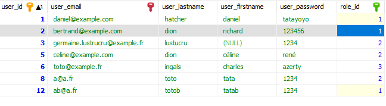

## Requêtes à implémenter (utilisateurs + rôles) 

1. Sélectionner tous les utilisateurs (identifiant nom, prénom, email et nom du rôle).

```sql
/* Sans jointure */
SELECT user_id, user_lastname, user_firstname, user_email, role_name 
FROM t_user, t_role 
WHERE t_user.role_id = t_role.role_id;

/* Avec jointure */
SELECT user_id, user_lastname, user_firstname, user_email, role_name 
FROM t_user 
JOIN t_role ON t_user.role_id = t_role.role_id;
```

2. Sélectionner tous les utilisateurs (identifiant nom, prénom, email, identifiant du rôle, nom du rôle). Trier les résultats par idetnfiant de rôle par ordre décroissant puis par nom de famille par ordre croissant.

```sql
SELECT user_id, user_lastname, user_firstname, user_email, t_role.role_id, role_name 
FROM t_user 
INNER JOIN t_role 
ON t_user.role_id = t_role.role_id
ORDER BY t_role.role_id DESC, user_lastname ASC;
```

3. Sélectionner tous les utilisateurs (identifiant nom, prénom, email, identifiant du rôle, nom du rôle) qui possèdent le rôle n°2

```sql
SELECT user_id, user_lastname, user_firstname, user_email, t_role.role_id, role_name 
FROM t_user 
INNER JOIN t_role ON t_user.role_id = t_role.role_id 
WHERE t_role.role_id = 2;
```

4. Sélectionner le nombre d'utilisateurs.

```sql
SELECT COUNT(user_id) FROM t_user;
```


5. Sélectionner, dans les rôles, le plus grand identifiant.

```sql
SELECT MAX(role_id) FROM t_role;
```


6. Sélectionner tous les rôles (identifiant du rôle, nom du rôle, description du rôle). Pour chaque rôle, afficher le nombre d'utilisateurs concernés.

Le résultat devrait ressembler à ceci  :

| role_id | role_name | role_description | nb_users |
| --- | --- | --- | --- |
| 1 | padawan | Les petits nouveaux | 2 |
| 2 | modérateur |  | 2 |
| 3 | administrateur | Les super pouvoirs | 1 |

```sql
SELECT role_name, role_description, COUNT(user_id)
FROM t_role
INNER JOIN t_user ON t_user.role_id = t_role.role_id
GROUP BY t_role.role_id;
```

7. Sélectionner la moyenne du nombre d'utilisateurs par rôle.

```sql
SELECT 
    (SELECT COUNT(user_id) FROM t_user) 
    / 
    (SELECT COUNT(role_id) FROM t_role);
```

8. Sélectionner nom, prénom, nom du rôle de tous les utilisateurs 
    avec pour chaque utilisateur 
    l'identifiant et nom de l'utilisateur possédant le même rôle et l'identifiant le plus petit.

Pour le jeu d'essai suivant : 



Le résulat pourrait ressembler à ceci :

| user_lastname | user_firstname | role_name | user_2_lastname | user_2_id |
| --- | --- | --- | --- | --- |
| dion | céline | modérateur | lustucru | 3 |
| ingals | charles | administrateur  | ingals | 6 | 


```sql


```
